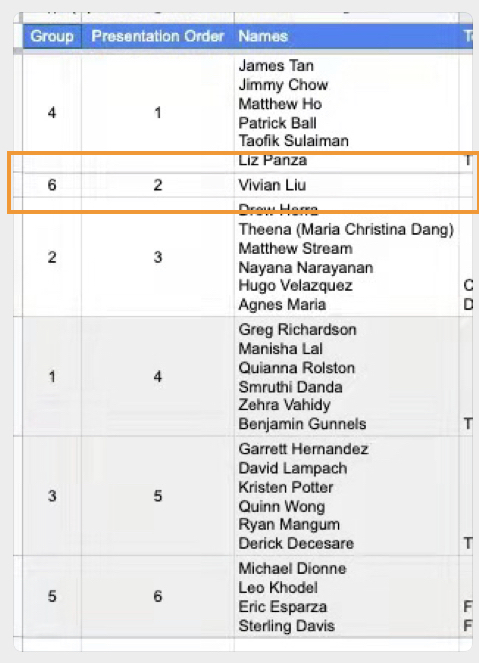
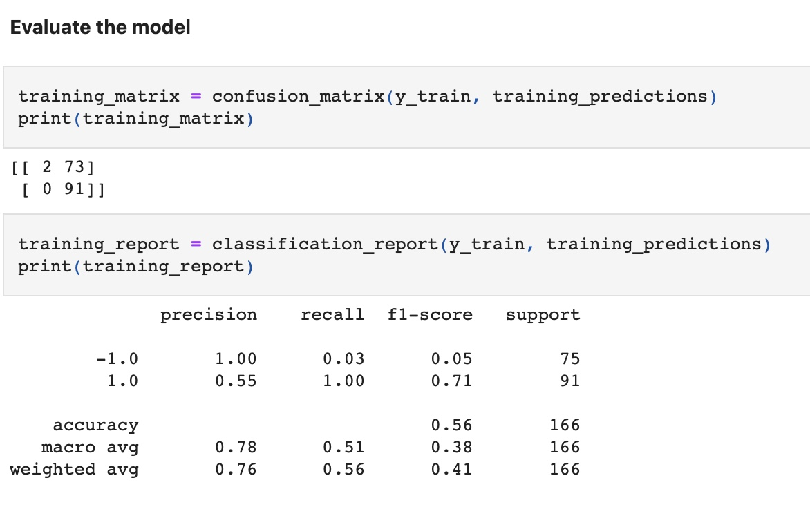
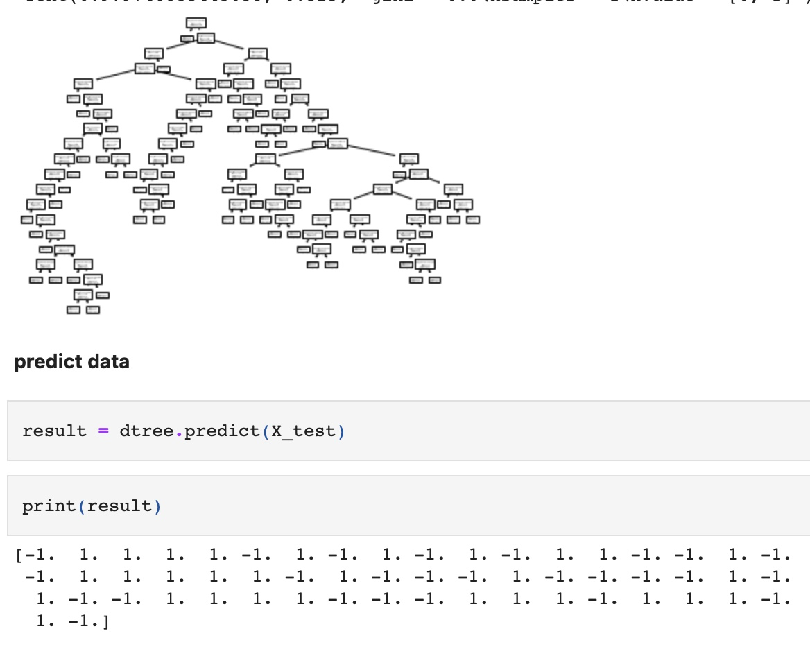
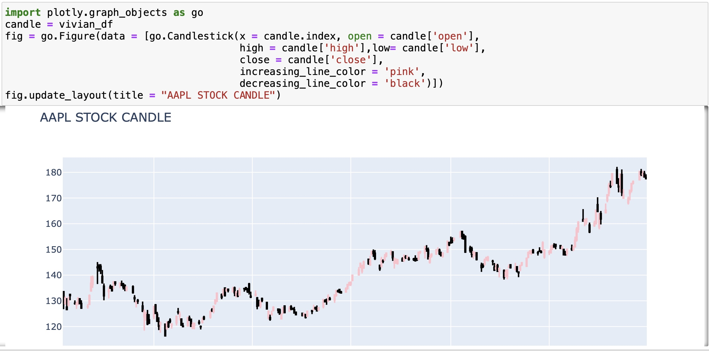

# Announcement
**Dear TA, Prof Kevin suggest me to do a make-up project by myself**<br/>
**Please help me to double check if I am in group 6, here is the attach pic**


# Overview
During the past few years, our company has experienced a high volume of customer increase.
As a financial advisor of an investment firm, we need an algorithm system to catch up the stock trading speed.
Traditional trading tools have many defects, so this time we are going to build a machine learning system, especially the models which implement neural network.
This will maintain our corporation’s competitive advantage in the market.
---
# Installation 
```python
import alpaca_trade_api as tradeapi
import os
import pandas as pd
import requests
from sklearn.model_selection import train_test_split
from sklearn.preprocessing import StandardScaler
from sklearn.linear_model import LogisticRegression
from sklearn.metrics import confusion_matrix
from sklearn.metrics import classification_report
from sklearn.tree import DecisionTreeClassifier
from sklearn import tree
from dotenv import load_dotenv
%matplotlib inline
```
---
# Usage
this file use sklearn machine learning library to predict apple stock
---
# Result



